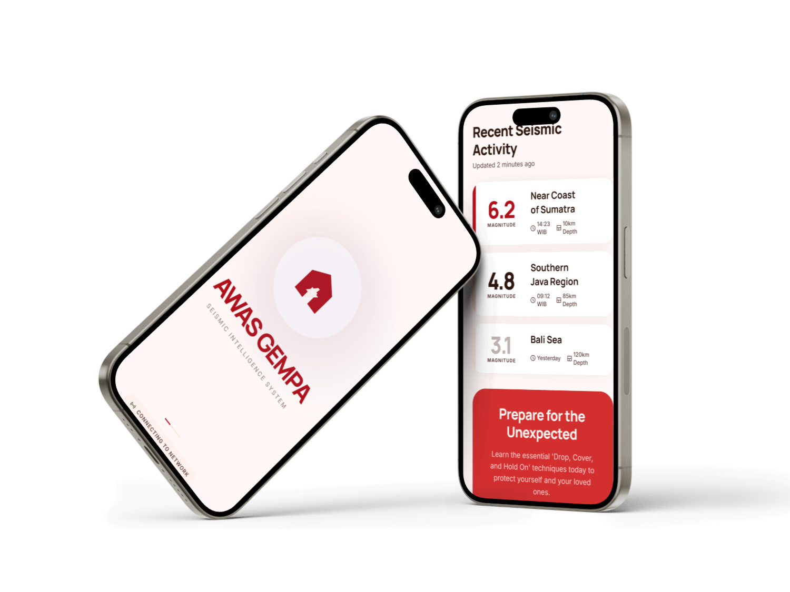
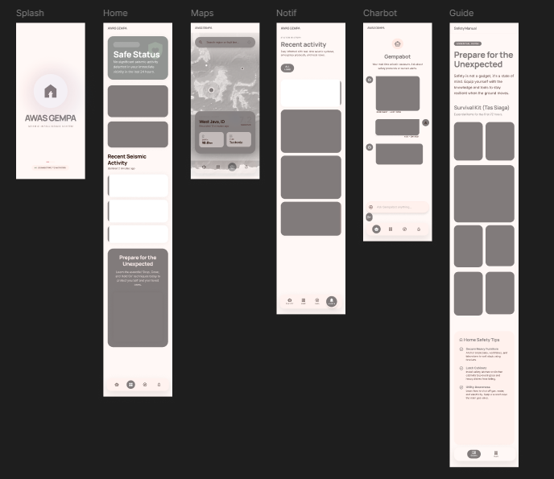
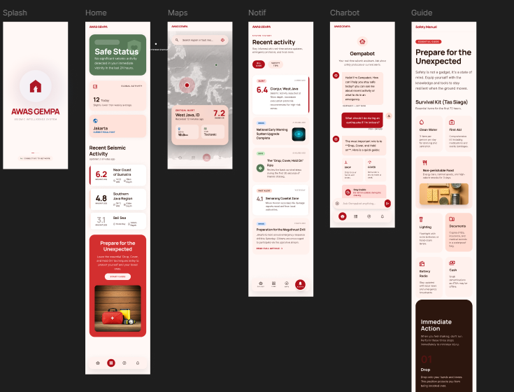
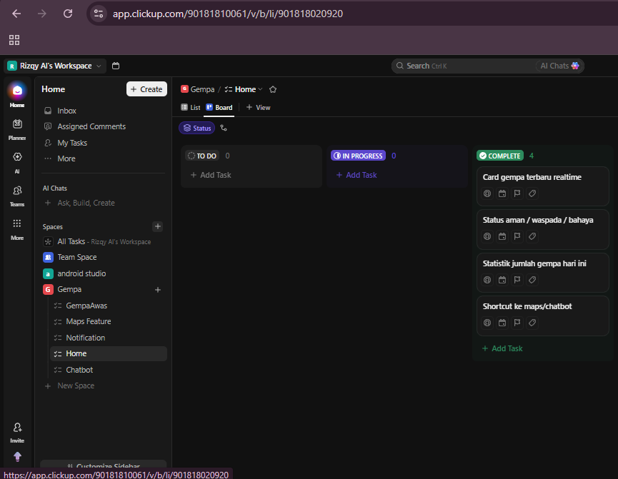
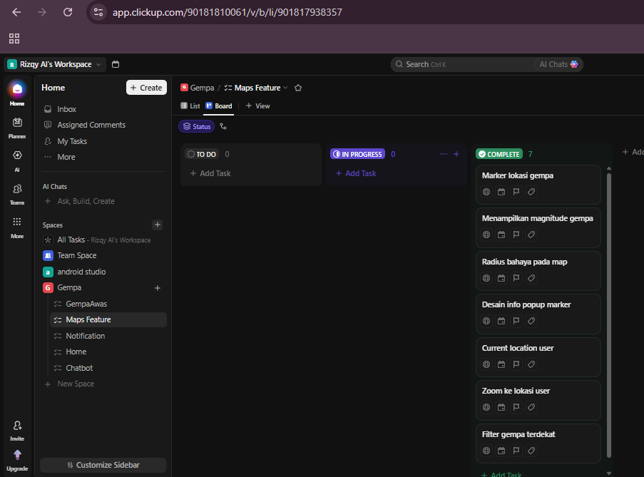
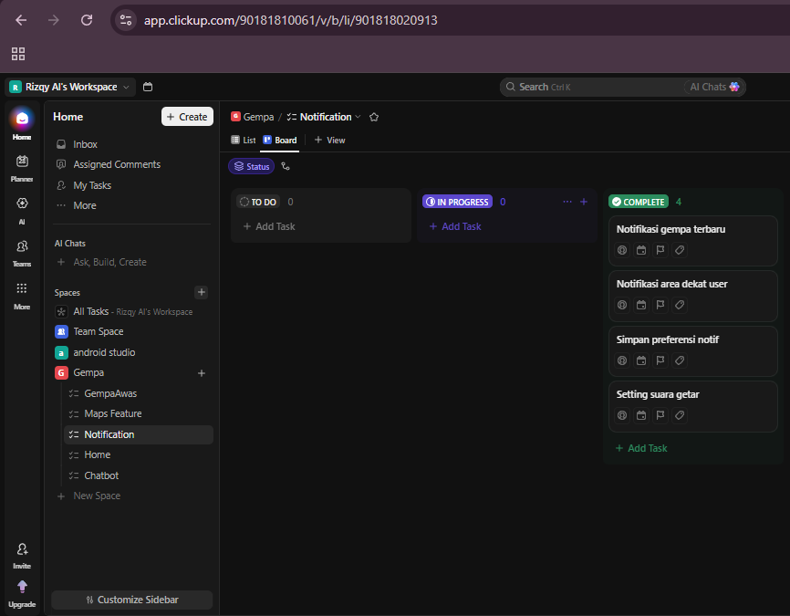
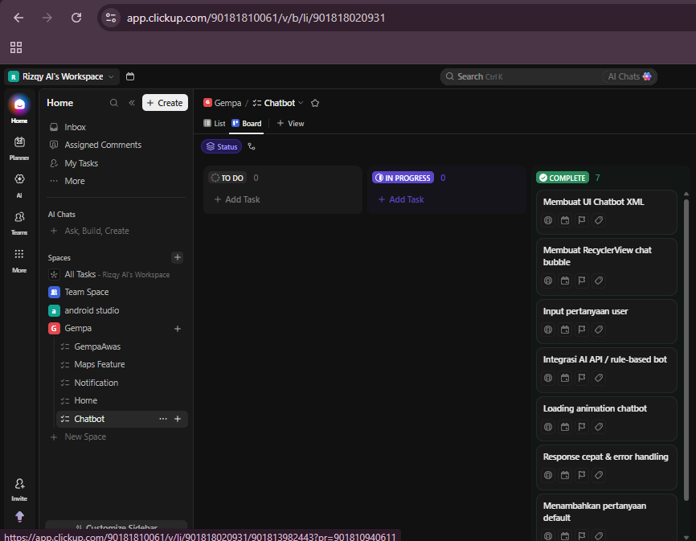
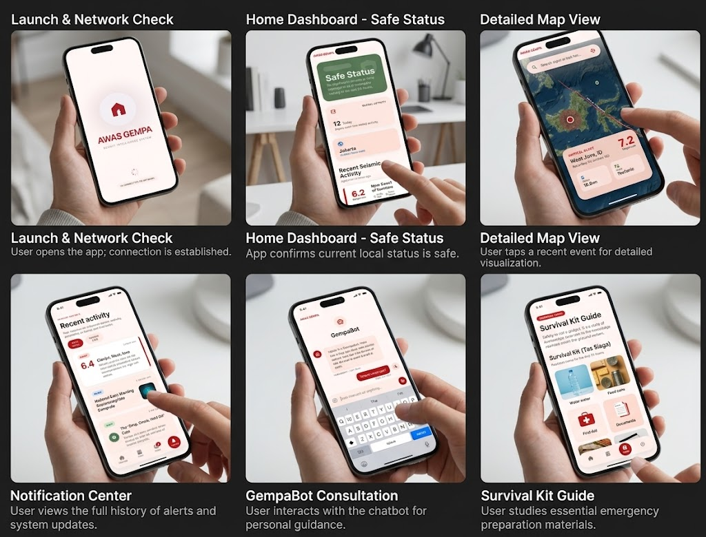
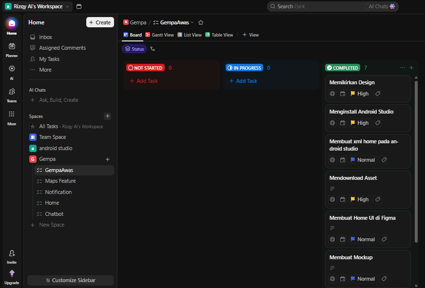

# 🏠 AWAS GEMPA
### *Seismic Intelligence System*

> Aplikasi Android berbasis AI untuk pemantauan gempa bumi real-time di Indonesia, terintegrasi dengan data resmi BMKG dan asisten cerdas Gemini AI.

<div align="center">



[](https://android.com)
[](https://java.com)
[](https://data.bmkg.go.id)
[](https://aistudio.google.com)
[](LICENSE)

</div>

## 🌋 Tentang Aplikasi

**AWAS GEMPA** adalah aplikasi Android yang dirancang untuk membantu masyarakat Indonesia mendapatkan informasi gempa bumi secara cepat dan akurat. Aplikasi ini menggunakan data real-time dari **BMKG (Badan Meteorologi, Klimatologi, dan Geofisika)** dan dilengkapi dengan asisten AI berbasis **Google Gemini** yang dapat menjawab pertanyaan seputar keselamatan gempa.

### Kenapa AWAS GEMPA?

- 🇮🇩 Indonesia berada di **Ring of Fire** — salah satu wilayah paling aktif seismik di dunia
- ⚡ Informasi gempa yang cepat dapat **menyelamatkan jiwa**
- 🤖 AI membantu masyarakat memahami **tingkat bahaya** berdasarkan lokasi mereka
- 📡 Data langsung dari **sumber resmi BMKG** — bukan hoaks

---

## ✨ Fitur Utama

| Fitur | Deskripsi |
|-------|-----------|
| 🏠 **Home Dashboard** | Status keamanan real-time berdasarkan lokasi GPS user |
| 🗺️ **Peta Interaktif** | Marker gempa di OSMDroid dengan radius bahaya |
| 🔔 **Notifikasi** | Push notification otomatis saat gempa terdeteksi |
| 🤖 **Chatbot AI** | Asisten Gemini dengan konteks data BMKG real-time |
| 📊 **Riwayat Gempa** | Daftar 15+ gempa terkini dari semua endpoint BMKG |
| 📍 **Deteksi Lokasi** | Hitung jarak user ke episentrum gempa |
| 🟢🟡🔴 **Sistem Warna** | Status AMAN / WASPADA / BAHAYA berdasarkan jarak + magnitudo |

---

## 📱 Mockup & Desain

Tampilan keseluruhan aplikasi AWAS GEMPA dalam mockup perangkat:


*Splash screen (kiri) menampilkan logo AWAS GEMPA saat pertama dibuka. Halaman utama (kanan) menampilkan aktivitas seismik terkini.*

---

## 📐 Wireframe

Wireframe low-fidelity seluruh alur aplikasi:



Wireframe mencakup 6 halaman utama:
- **Splash** — layar pembuka saat aplikasi dijalankan
- **Home** — dashboard utama status keamanan
- **Maps** — peta interaktif lokasi gempa
- **Notif** — pusat notifikasi dan riwayat gempa
- **Charbot** — antarmuka chatbot Gemini AI
- **Guide** — panduan keselamatan darurat

---

## 🎨 UI Design

Tampilan antarmuka final aplikasi dengan desain lengkap:



### Halaman-halaman Utama:

#### 🏠 Home


Halaman utama menampilkan:
- Status sistem (Aman / Waspada / Bahaya) berdasarkan GPS
- Jumlah gempa hari ini dari BMKG
- Card gempa terbaru dengan magnitudo, lokasi, dan kedalaman
- Alert card merah/oranye saat ada gempa signifikan

#### 🗺️ Maps


Halaman peta menampilkan:
- Peta OSMDroid full-screen dengan tile MAPNIK
- Marker lingkaran berwarna (merah/oranye/hijau) per gempa
- Radius dampak saat marker diklik
- Filter gempa: ALL / KUAT / SEDANG / RINGAN
- Detail card gempa di bagian bawah
- Auto-refresh setiap 3 menit

#### 🔔 Notifikasi


Halaman notifikasi menampilkan:
- Riwayat semua gempa dari BMKG (termasuk M < 5.0)
- Badge severity: KUAT / SEDANG / RINGAN
- Ringkasan total gempa dan jumlah gempa kuat
- Background service polling setiap 3 menit

#### 🤖 Chatbot


Halaman chatbot menampilkan:
- Interface chat bubble (merah = user, putih = bot)
- Quick reply chips untuk pertanyaan umum
- Integrasi Gemini 1.5 Flash dengan konteks data BMKG
- Multi-turn conversation (bot ingat riwayat chat)
- Loading indicator saat menunggu respons AI

---

## 📖 Storyboard

Alur perjalanan pengguna (user journey) dari buka app hingga mendapat informasi gempa:



| Scene | Deskripsi |
|-------|-----------|
| **1. Launch & Network Check** | User membuka app, sistem memeriksa koneksi jaringan |
| **2. Home Dashboard - Safe Status** | App mengonfirmasi status aman di lokasi user saat ini |
| **3. Detailed Map View** | User mengetuk event gempa untuk melihat visualisasi detail di peta |
| **4. Notification Center** | User melihat riwayat lengkap alert dan update sistem |
| **5. GempaBot Consultation** | User berinteraksi dengan chatbot AI untuk panduan personal |
| **6. Survival Kit Guide** | User mempelajari persiapan darurat dan perlengkapan siaga |

---

## 📋 Project Management (ClickUp)

Pengembangan aplikasi ini dikelola menggunakan **ClickUp** sebagai tools manajemen proyek.

### GempaAwas (Main Project)


Task yang telah diselesaikan:
- ✅ Memikirkan Design
- ✅ Menginstall Android Studio
- ✅ Membuat XML Home di Android Studio
- ✅ Mendownload Asset
- ✅ Membuat Home UI di Figma
- ✅ Membuat Mockup

### Home Feature


Task yang telah diselesaikan:
- ✅ Card gempa terbaru realtime
- ✅ Status aman / waspada / bahaya
- ✅ Statistik jumlah gempa hari ini
- ✅ Shortcut ke maps/chatbot

### Maps Feature


Task yang telah diselesaikan:
- ✅ Marker lokasi gempa
- ✅ Menampilkan magnitude gempa
- ✅ Radius bahaya pada map
- ✅ Desain info popup marker
- ✅ Current location user
- ✅ Zoom ke lokasi user
- ✅ Filter gempa terdekat

### Notification Feature


Task yang telah diselesaikan:
- ✅ Notifikasi gempa terbaru
- ✅ Notifikasi area dekat user
- ✅ Simpan preferensi notif
- ✅ Setting suara getar

### Chatbot Feature


Task yang telah diselesaikan:
- ✅ Membuat UI Chatbot XML
- ✅ Membuat RecyclerView chat bubble
- ✅ Input pertanyaan user
- ✅ Integrasi AI API / rule-based bot
- ✅ Loading animation chatbot
- ✅ Response cepat & error handling
- ✅ Menambahkan pertanyaan default

---

## 🛠️ Tech Stack

```
📱 Platform      : Android (Java)
🎨 UI Library    : Material Design 3
🗺️ Maps          : OSMDroid (OpenStreetMap)
🌐 Networking    : Retrofit 2 + OkHttp
📡 Data Source   : BMKG Open API
🤖 AI Engine     : Google Gemini 1.5 Flash
📍 Location      : Android LocationManager (GPS + Network)
🔔 Notification  : Android Notification Manager
💾 Storage       : SharedPreferences
```

### Dependencies (build.gradle)

```gradle
dependencies {
    // UI
    implementation 'com.google.android.material:material:1.11.0'
    implementation 'androidx.constraintlayout:constraintlayout:2.1.4'

    // Networking
    implementation 'com.squareup.retrofit2:retrofit:2.9.0'
    implementation 'com.squareup.retrofit2:converter-gson:2.9.0'
    implementation 'com.squareup.okhttp3:okhttp:4.12.0'

    // Maps (OpenStreetMap - GRATIS)
    implementation 'org.osmdroid:osmdroid-android:6.1.18'

    // Location
    implementation 'androidx.core:core-ktx:1.12.0'
}
```

### API yang Digunakan

| API | Endpoint | Kegunaan |
|-----|----------|----------|
| BMKG | `autogempa.json` | 1 gempa terbaru M≥5.0 |
| BMKG | `gempaterkini.json` | 15 gempa terkini M≥5.0 |
| BMKG | `gempadirasakan.json` | Semua gempa yang dirasakan |
| Gemini | `v1beta/models/gemini-1.5-flash` | Chatbot AI |

---

## 🚀 Instalasi

### Prasyarat
- Android Studio Hedgehog (2023.1.1) atau lebih baru
- JDK 17+
- Android SDK API 24+
- Koneksi internet (untuk data BMKG & Gemini)

### Langkah Instalasi

1. **Clone repository**
```bash
git clone https://github.com/RizqyAl34/awas-gempa2.git
cd awas-gempa2
```

2. **Buka di Android Studio**
```
File → Open → pilih folder awas-gempa2
```

3. **Setup API Key Gemini**

Buka atau buat file `local.properties` di root project:
```properties
GEMINI_API_KEY=masukkan_api_key_kamu_disini
```

Dapatkan API key gratis di [aistudio.google.com](https://aistudio.google.com)

4. **Sync Gradle**
```
File → Sync Project with Gradle Files
```

5. **Run aplikasi**
```
Run → Run 'app' (Shift+F10)
```

---

## 📖 Cara Penggunaan

### 1. Pertama kali buka app
- Izinkan akses **lokasi** saat diminta → untuk deteksi jarak ke gempa
- Izinkan akses **notifikasi** saat diminta → untuk alert gempa otomatis

### 2. Membaca status di Home
| Warna | Arti |
|-------|------|
| 🟢 Hijau | Aman — tidak ada gempa signifikan di sekitar kamu |
| 🟡 Oranye | Waspada — ada gempa sedang dalam radius 300 km |
| 🔴 Merah | Bahaya — gempa kuat dalam radius 100 km! |

### 3. Melihat peta gempa
- Buka halaman **Maps**
- Tap marker untuk detail gempa + radius dampak
- Gunakan filter **KUAT / SEDANG / RINGAN** untuk memfilter

### 4. Tanya chatbot
- Buka halaman **Chatbot**
- Gunakan quick reply atau ketik pertanyaan sendiri
- Contoh: *"Apakah aman di lokasi saya sekarang?"*

---

## 📁 Struktur Project

```
app/src/main/
├── java/com/example/gempa/
│   ├── MainActivity.java              # Home dashboard
│   ├── MapsActivity.java              # Peta OSMDroid
│   ├── AlertsActivity.java            # Riwayat notifikasi
│   ├── ChatbotActivity.java           # Chatbot Gemini
│   ├── EarthquakeResponse.java        # Model data BMKG
│   ├── EarthquakeApiService.java      # Retrofit interface BMKG
│   ├── RetrofitClient.java            # HTTP client BMKG
│   ├── EarthquakeNotificationService.java  # Background service notif
│   ├── EarthquakeAlertAdapter.java    # RecyclerView adapter alerts
│   ├── ChatAdapter.java               # RecyclerView adapter chat
│   ├── ChatMessage.java               # Model pesan chat
│   ├── GeminiApiService.java          # Retrofit interface Gemini
│   ├── GeminiClient.java              # HTTP client Gemini
│   ├── GeminiRequest.java             # Model request Gemini
│   └── GeminiResponse.java            # Model response Gemini
├── res/
│   ├── layout/
│   │   ├── activity_main.xml
│   │   ├── activity_maps.xml
│   │   ├── activity_alerts.xml
│   │   ├── activity_chatbot.xml
│   │   ├── item_earthquake_alert.xml
│   │   ├── item_chat_user.xml
│   │   ├── item_chat_bot.xml
│   │   └── item_chat_loading.xml
│   ├── drawable/                      # Icon, background shapes
│   ├── values/
│   │   ├── colors.xml
│   │   └── strings.xml
│   └── xml/
│       └── network_security_config.xml
└── AndroidManifest.xml
```

---

## 👨‍💻 Tim

| Nama | NIM | Role |
|------|-----|------|
| M. Rizqy Al Rasyd | 312410424 | Mobile Developer |

**Universitas Pelita Bangsa**
Program Studi Teknik Informatika
Mata Kuliah: Pemrograman Mobile

---

## 📄 Lisensi

```
MIT License — bebas digunakan untuk keperluan pendidikan
Data gempa © BMKG (Badan Meteorologi, Klimatologi, dan Geofisika)
AI powered by Google Gemini
Maps powered by OpenStreetMap contributors
```

---

<div align="center">

**Dibuat dengan ❤️ untuk keselamatan masyarakat Indonesia**

*"Informasi yang cepat adalah pertahanan pertama dari bencana"*

</div>
